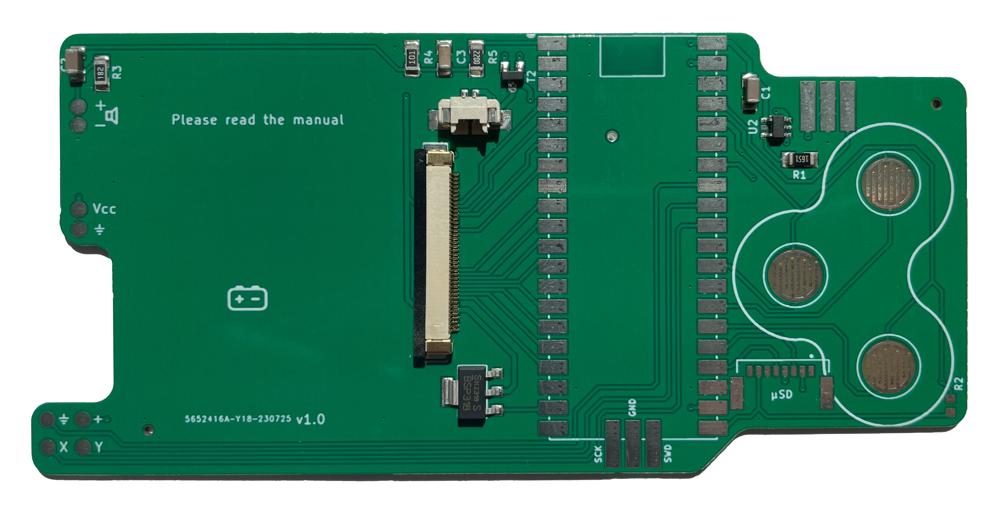

# Pico Held hardware files

Here you can find the PCB design files, BOM and CPL files, STL files of the case, schematics, components and datasheets for the *Pico Held* - a handheld based on the *Raspberry Pi Pico*.

The hardware project is released under the *Creative Commons NonCommercial license* (BY-NC, non-commercial use).

I am currently still looking for a distributor, so currently the only way to get a *Pico Held* is making your own PCB and case.

## Case

I had the cases printed over at *JLCPCB* (no affiliation) using resin printing with - in my eyes - a very good result.

## PCB production parameters

Some notes for PCB production:

PCB thickness needs to be 1.2 mm (this is important for proper button haptics). Vias need to be untented for the recovery mechanism on the back to work. (Short the exposed via on the back side to ground when turning on the *Pico Held* to force bootloader mode).
Also, choosing "HASL leadfree" is definitely advised.

## Support

If you like my work and would like to support me you might want to consider buying me a coffee :)

  

(Image by github.com/andreostrovsky -- Thanks!)